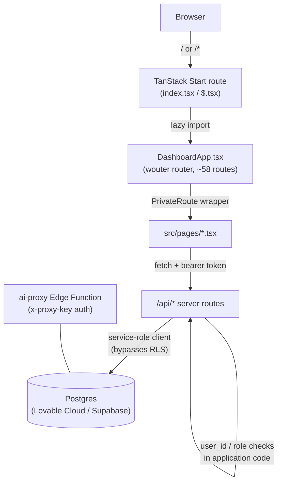
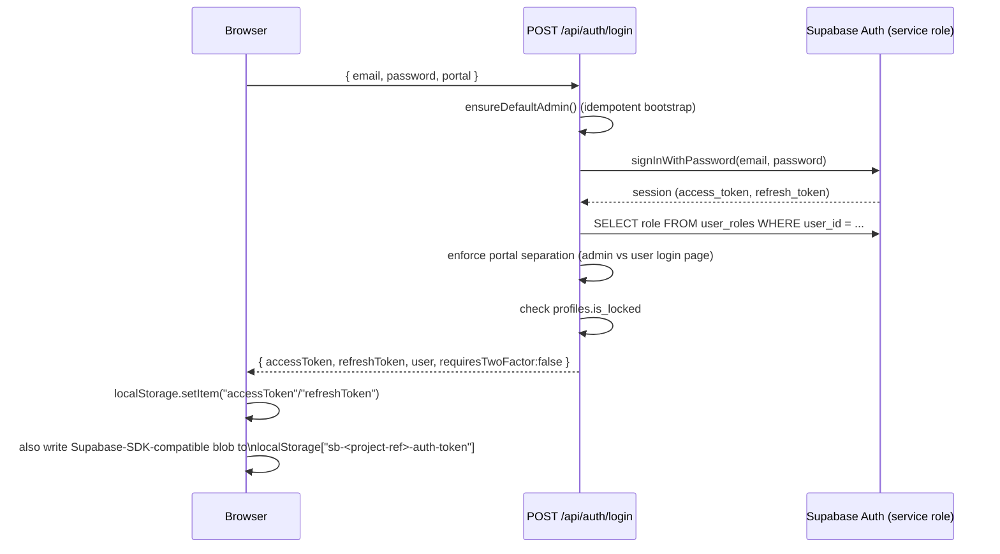

# Development Guide — Infinity Sales Pro / Sales 360 App

This guide documents the system as it actually exists in this repository and in the connected Supabase (Lovable Cloud) project as of this writing. It is written for a senior engineer onboarding onto the codebase. Every claim below was verified directly against source files, migrations, or the live database — nothing here is speculative. Where the implementation has a real gap or inconsistency, it is called out explicitly rather than glossed over, because that is what a new engineer actually needs to know before touching the code.

Three companion documents should be read alongside this guide:

- `README.md` — project setup: installation, environment variables, running locally, build/test/deploy commands.
- `CLAUDE.md` — repository- and tool-specific instructions for Claude Code.
- `AI_RULES.md` — universal engineering rules for any AI coding assistant working on this project.

`README.md` covers *how to run the project*; this guide covers *how the system actually works*, in depth.

---

## Table of Contents

1. [Project Overview](#1-project-overview)
2. [Technology Stack](#2-technology-stack)
3. [Folder Structure](#3-folder-structure)
4. [Application Architecture](#4-application-architecture)
5. [Authentication Flow](#5-authentication-flow)
6. [Authorization & Permission Model](#6-authorization--permission-model)
7. [Database Architecture](#7-database-architecture)
8. [Database Relationships](#8-database-relationships)
9. [Row Level Security](#9-row-level-security)
10. [API Routes](#10-api-routes)
11. [Edge Functions](#11-edge-functions)
12. [Storage Buckets](#12-storage-buckets)
13. [Product Management](#13-product-management)
14. [Inventory Management](#14-inventory-management)
15. [Purchase Workflow](#15-purchase-workflow)
16. [Sales Workflow](#16-sales-workflow)
17. [Warehouse Workflow](#17-warehouse-workflow)
18. [Supplier Workflow](#18-supplier-workflow)
19. [Customer Workflow](#19-customer-workflow)
20. [Product Categories](#20-product-categories)
21. [Reports](#21-reports)
22. [Background Jobs](#22-background-jobs)
23. [Environment Variables](#23-environment-variables)
24. [Build Process](#24-build-process)
25. [Package Manager](#25-package-manager)
26. [Testing Strategy](#26-testing-strategy)
27. [Deployment Process](#27-deployment-process)
28. [Migration Strategy](#28-migration-strategy)
29. [Security Considerations](#29-security-considerations)
30. [Performance Considerations](#30-performance-considerations)
31. [Coding Standards Used](#31-coding-standards-used)
32. [Known Technical Debt](#32-known-technical-debt)
33. [Recommended Future Improvements](#33-recommended-future-improvements)

---

## 1. Project Overview

Infinity Sales Pro (Supabase project name: **Sales 360 App**) is a single web application covering point-of-sale, inventory/warehouse management, purchasing, HR, accounting, and reporting for retail and wholesale businesses. It is a **Lovable-managed** project — it may be edited directly in this repo or through the Lovable web editor, and the backend (Postgres, Auth, Storage) is provisioned and managed through **Lovable Cloud**, which is Supabase under the hood.

The frontend is a React 19 single-page application. The backend is a set of TanStack Start server routes running against a Supabase Postgres database, plus one Supabase Edge Function used for external AI-proxy access.

## 2. Technology Stack

| Layer | Technology |
| --- | --- |
| Frontend framework | React 19, TanStack Start (SSR/server-route shell) |
| Client-side app routing | **wouter** (not TanStack Router — see [Architecture](#4-application-architecture)) |
| Styling | Tailwind CSS v4, `tw-animate-css` |
| UI components | shadcn/ui ("new-york" style, slate base), Radix UI primitives, `lucide-react` icons |
| Data fetching | TanStack React Query v5, an Orval-generated typed API client (`src/workspace/api-client-react`) |
| Forms | `react-hook-form` + `zod` resolvers |
| Charts | `recharts` |
| Backend/data | Supabase (Postgres 17.6) via Lovable Cloud, `@supabase/supabase-js` |
| Server runtime | TanStack Start server routes (`src/routes/api/*`), Nitro build target |
| Build tool | Vite 7 (via `@lovable.dev/vite-tanstack-config`), Nitro (Cloudflare Workers preset by default) |
| Package manager | pnpm (pinned `9.15.0`) |
| Testing | Vitest (unit, jsdom), Playwright (E2E) |
| Linting/formatting | ESLint 9 flat config + typescript-eslint, Prettier (run as an ESLint rule) |
| Misc libraries | `exceljs`, `jspdf`/`jspdf-autotable`, `docx` (exports), `qrcode.react`, `framer-motion`, `date-fns` |

## 3. Folder Structure

```
.
├── src/
│   ├── DashboardApp.tsx        # wouter SPA shell: providers, lazy page imports, PrivateRoute, full route table
│   ├── router.tsx               # TanStack Start router factory (outer shell only)
│   ├── routeTree.gen.ts         # auto-generated TanStack Start route tree — do not edit
│   ├── server.ts / start.ts     # TanStack Start server entry points
│   ├── routes/                  # TanStack Start file-based routes (outer layer)
│   │   ├── __root.tsx           # HTML shell / root layout, meta tags, error/not-found boundaries
│   │   ├── index.tsx, $.tsx     # both just lazy-mount DashboardApp
│   │   ├── sitemap[.]xml.ts
│   │   └── api/                 # ~190 server route files = the REST API (see §10)
│   │       ├── auth/            # /api/auth/* — login, register, 2FA, password reset, admin user mgmt
│   │       ├── admin/           # /api/admin/* — audit logs, IP blocks, online users, system info
│   │       ├── sessions/        # /api/sessions/* — heartbeat / end (who's-online tracking)
│   │       ├── reports/         # /api/reports/* — 22 live reporting endpoints
│   │       └── (domain files + shared _helpers, see §10)
│   ├── pages/                   # 58 page components, one per application route
│   ├── components/              # shared UI (app-layout.tsx = sidebar/topbar shell used by every page)
│   │   └── ui/                  # 55 shadcn/ui primitives
│   ├── lib/                     # auth-context, permissions-context, api-bootstrap, error handling, utils
│   ├── hooks/                   # use-online-users, use-realtime-sync, use-session-heartbeat, use-mobile
│   ├── integrations/supabase/   # auto-generated client.ts / client.server.ts / types.ts — do not hand-edit
│   ├── workspace/api-client-react/ # Orval-generated typed API client consumed by pages/lib
│   └── test/                    # Vitest setup
├── supabase/
│   ├── migrations/               # 41 SQL migration files (see §28)
│   └── functions/ai-proxy/       # the one Supabase Edge Function in this repo
├── e2e/                          # Playwright end-to-end tests
├── public/                       # static assets
├── scripts/                      # tooling (Supabase type generation)
└── dist/                         # build output (generated)
```

`src/routes/README.md` documents TanStack Start's file-routing conventions — never place page components or Next.js/Remix-style `app/` directories under `src/routes/`; that directory is exclusively the TanStack file router.

## 4. Application Architecture

The codebase deliberately runs **two separate routing systems**:

1. **TanStack Start file-based routes** (`src/routes/`) handle exactly three things: the root HTML shell (`__root.tsx`), the `/api/*` server endpoints, and two catch-all page routes (`index.tsx` for `/`, `$.tsx` for everything else) that both lazy-`import()` and mount `src/DashboardApp.tsx`.
2. **The actual application** is a client-side SPA inside `DashboardApp.tsx`, routed with **wouter**, rendering lazy-loaded pages from `src/pages/*.tsx`.



**Provider chain** (`DashboardApp.tsx`): `QueryClientProvider` → `TooltipProvider` → `ThemeProvider` → wouter `Router` → `AuthProvider` → `PermissionsProvider` → the route `Switch`.

**`PrivateRoute`** wraps every protected page and accepts `component`, `adminOnly`, `adminOrManager`, `permKey`, and `defaultAllow`. It delegates the actual redirect decision to the pure function `protectedRouteRedirect` (`src/lib/auth-routing.ts`), checks `useAuth()` for authentication and `usePermissions().canAccess(permKey, defaultAllow)` for module visibility, and renders `<AppLayout><Component/></AppLayout>` once both checks pass. Several modules (HRM, product transfers) default `defaultAllow` to `false`, meaning they are hidden until an admin explicitly enables the corresponding permission flag; most other modules default to visible.

**Server-side pattern.** Nearly every `/api/*` route goes through `src/routes/api/_resource-helpers.ts`, which exports:

- `requireUser` / `requireAdmin` / `requireHrmAccess` — auth/role guards.
- `listCreateHandlers(opts)` / `itemHandlers(opts)` — generic CRUD factories for simple, ownership-scoped resources (list+create, and get/update/delete by id). Used by ~30 resource files (employees, departments, serial numbers, projects, price lists, bank accounts, cash sessions, notifications, ESL devices, POS connections, stock takes, tasks, duty roster, etc.).
- `rowToApi` / `apiToRow` — shallow snake_case ⇄ camelCase row/API converters; `apiToRow` also strips `id`/`createdAt`/`updatedAt`/`userId` from inbound bodies so clients can't overwrite them.
- `notify()` — best-effort in-app notification insert (`src/routes/api/_notify.ts`), errors are swallowed.
- `sb` — the shared `supabaseAdmin` (service-role) client handle.

Routes with transactional or cross-table logic (sales, purchasing, stock movements, purchase returns) bypass the generic factories and hand-roll handlers, sometimes calling `SECURITY DEFINER` Postgres functions via `.rpc()` for atomicity (confirmed actual `.rpc()` call sites: `complete_purchase_return`, `reverse_purchase_return`, `next_purchase_return_number`).

**Critical architectural point:** every server route uses the **service-role Supabase client** (`supabaseAdmin`), which **bypasses Row Level Security**. Access control is therefore enforced in **application code** — ownership filters (`.eq("user_id", user.id)`), role checks, and the `perm_*` permission model — not by the database. RLS policies exist on all tables as defense-in-depth in case the database is ever queried with a non-service-role key, but they are not the primary authorization boundary for this app today. See [§9](#9-row-level-security) and [§29](#29-security-considerations).

## 5. Authentication Flow



- **Token issuance**: `src/routes/api/auth/login.ts` creates a request-scoped service-role Supabase Auth client and calls `signInWithPassword`. It resolves the caller's role from `user_roles` (`resolveLoginRole`, `-auth-role-helpers.ts`), enforces **portal separation** (admin accounts must log in via `/admin/login`; non-admins are rejected from the admin portal; accounts with no role are rejected), and checks `profiles.is_locked`. Any rejection revokes the just-issued Supabase session and clears auth cookies.
- **Token storage**: `src/lib/auth-context.tsx` stores `accessToken`/`refreshToken` in `localStorage`, and additionally writes a Supabase-SDK-compatible session blob to `localStorage["sb-<project-ref>-auth-token"]` purely so the Supabase JS client/Realtime can reuse the same token — the app's own `/api/auth/*` endpoints remain the source of truth. `logout()` best-effort POSTs `/api/sessions/end`, clears storage, and redirects to `/login`.
- **Request authentication**: `getBearerUser(request)` (`_auth-helpers.ts`) strips a `Bearer ` prefix from the `Authorization` header and validates it via `supabaseAdmin.auth.getUser(token)`. `loadUserShape()` then joins `profiles` (by `auth_id`) and `user_roles` to build the app-level user shape: `{ id, name, email, role, twoFactorEnabled, isLocked, mustChangePassword, createdAt }`.
- **Role hierarchy** (`ROLE_PRIORITY`, `_auth-helpers.ts`):
  ```
  admin > manager > accountant > cashier > user
  ```
  When a user has multiple `user_roles` rows, the highest-priority role wins.
- **Two-factor authentication (TOTP)** exists as a self-contained feature (`setup-2fa` generates a base32 secret + QR code and stages it in `user_settings.data.pending_2fa_secret`; `confirm-2fa` verifies and persists it as `two_factor_secret`, setting `profiles.two_factor_enabled = true`; `verify-2fa` checks a code against the confirmed secret) but is **not currently wired into the login gate** — `login.ts` always returns `requiresTwoFactor: false` regardless of whether the user has 2FA enabled. See [§29](#29-security-considerations).
- **Password reset**: `forgot-password` always returns a generic success message (anti-enumeration) and calls `supabaseAdmin.auth.resetPasswordForEmail`. `reset-password` exchanges the recovery token via `verifyOtp({ type: "recovery" })` and clears `must_change_password`. `change-password` (self-service) re-authenticates with the current password first.
- **Session/presence tracking**: `user_sessions` is used for "who's online" tracking, **not** primary auth — `POST /api/sessions/heartbeat` upserts a row per user with `last_seen`, and stale rows (>5 min) are opportunistically pruned; `POST /api/sessions/end` deletes the row on logout.
- **`pending_logins` is dead code**: this table exists live in the database (columns: `token`, `user_id`, `email`, `access_token`, `refresh_token`, `created_at`, `expires_at`) with RLS enabled and **zero policies**, but has **zero rows**, **zero references anywhere in application code**, and **no corresponding migration file** in this repo. It appears to be a leftover from an abandoned or never-implemented login-handoff feature. See [§29](#29-security-considerations) and [§32](#32-known-technical-debt).
- **Default admin bootstrap**: `ensureDefaultAdmin()` (`_auth-helpers.ts`) runs on **every** login POST request (idempotent per server process), but is a no-op unless both `DEFAULT_ADMIN_BOOTSTRAP_EMAIL` and `DEFAULT_ADMIN_BOOTSTRAP_PASSWORD` are set in the server environment. If both are configured and no profile exists yet for that email, it creates one with `must_change_password: true`; an existing account with that email is never modified. Neither value is ever logged. See [§29](#29-security-considerations).

## 6. Authorization & Permission Model

Permission flags are stored as `perm_*` keys inside the JSONB `data` column of `public.user_settings`, keyed to the **administrator's** row, not per-user — they are effectively global switches configured by whichever admin last saved them.

**Server (`src/routes/api/-permission-helpers.ts`):**

- `globalUserPermissions()` — finds all `admin`-role users, loads their `user_settings` ordered by `updated_at` descending, and returns the `perm_*`-prefixed subset of the **first** admin settings row that actually has permission keys set.
- `requirePermission(request, key, defaultAllow = false)` — authenticates the caller; if they hold the `admin` role, access is auto-granted. Otherwise it looks up `globalUserPermissions()[key]`: `null`/`undefined` falls back to `defaultAllow`, otherwise access is denied only if the stored value is boolean `false` or the string `"false"`.

**Client (`src/lib/permissions-context.tsx`):** `usePermissions().canAccess(permKey, defaultAllow)` mirrors the server logic exactly — always `true` for admins, `defaultAllow` while loading, then the same `null → defaultAllow` / `"false" → deny` rule against the caller's merged `/api/settings` response.

**`GET/PUT /api/settings`**: `GET` merges `globalUserPermissions()` into a non-admin caller's own settings; `PUT` strips any permission key from the request body unless the caller is admin, so a regular user cannot self-grant permissions.

**Route-level permission keys** (from `DashboardApp.tsx`'s route table — `permKey` / `defaultAllow`):

| Module | permKey | defaultAllow |
| --- | --- | --- |
| Sales, Quotations, Sales Returns, Price Lists, Promotions | `perm_user_sales` | `true` |
| Customers, People | `perm_user_customers` | `true` |
| Products, Adjustments, Warehouses, Serial Numbers, Branches, Stock Take, ESL, Label Printer | `perm_user_inventory` | `true` |
| Reports, Analytics, AI Insights, VAT Report | `perm_user_reports` | `true` |
| Settings | `perm_user_settings` | `true` |
| Purchases, Purchase Returns, Suppliers, Supplier Invoices, Reorder Rules | `perm_user_purchases` | `true` |
| **HRM, Duty Roster, Payroll, Leave, Attendance, Departments** | `perm_user_hrm` | **`false`** (opt-in) |
| **Product Transfer** | `perm_user_product_transfers` | **`false`** (opt-in) |
| Accounting, Expenses, Cash Management, Customer Credits, Bank Reconciliation | `perm_user_accounting` | `true` |
| POS | `perm_user_pos` | `true` |
| Projects | `module_projects` | `true` |
| Tasks | `module_tasks` | `true` |
| Generated Reports, Security Centre, Product Categories (admin page), Admin Settings, Audit Logs, Backup, Recycle Bin | — | `adminOnly=true` |
| Import Portal | — | `adminOrManager=true` |

A few subsystems duplicate this logic rather than reusing it:

- **HRM** has its own `requireHrmAccess()` guard (`_resource-helpers.ts`) that re-checks `admin` role then reads `user_settings.data.perm_user_hrm` directly, instead of calling `requirePermission`.
- **Purchase returns** use a dedicated `requireReturnPermission(request, action, defaultAllow)` with per-action keys (`perm_purchase_returns_view/create/edit/cancel/submit/approve/complete/settle`), falling back to the legacy `perm_user_purchases` key.

## 7. Database Architecture

| | |
| --- | --- |
| Provider | Supabase (via Lovable Cloud) |
| Project name | Sales 360 App |
| Project ref | `vcgtjdkpgbkyzrbonkbs` |
| Organization | Infinity-Sale-360 Org (free plan) |
| Postgres version | 17.6.1.127 |
| Public schema tables | 59, all with Row Level Security **enabled** |
| Installed extensions | `pgcrypto`, `pg_stat_statements`, `uuid-ossp` (all in the `extensions` schema), `supabase_vault`, `plpgsql`. Everything else Supabase offers (`pg_cron`, `pg_net`, `http`, `vector`, PostGIS, etc.) is **available but not installed**. |
| Storage buckets | 1 (`product-images`, private) |
| Edge Functions | 1 (`ai-proxy`) |
| Migrations | 41 files in `supabase/migrations/`, all applied and matching the live migration history 1:1 by name — **but see [§28](#28-migration-strategy) for confirmed schema drift beyond the migration list itself** |

**Primary-key convention is inconsistent across tables** — this is a real, load-bearing quirk to know before writing queries:

- Older/shared-directory tables (`customers`, `warehouses`, `suppliers`) have a legacy `bigint id` **and** a `uuid uuid_id` column; foreign keys from newer tables point at `uuid_id`, not `id` (e.g. `sales.customer_id → customers.uuid_id`).
- Most transactional tables (`products`, `sales`, `purchase_orders`, `quotations`, `sales_returns`, `purchase_returns`, `stock_movements`, `price_lists`, `promotions`) use a native `uuid id` primary key directly.
- Server-side helpers normalize between the two forms where needed (e.g. `resolveCustomer`/`customerUuid` in `-customer-credit-helpers.ts`, `resolveWarehouse` in `-stock-helpers.ts`, which detect a UUID via regex and pick the right FK column).

**Line items are mostly denormalized JSONB, not child tables.** `sales.items`, `purchase_orders.items`, `quotations.items`, `sales_returns.items`, and `purchase_returns.items` are all JSONB arrays embedded directly in the parent row — line items are snapshotted at transaction time (including a category snapshot for reporting) rather than stored as normalized rows. The one exception is `purchase_return_items`, which **is** a proper normalized child table (with its own `id`, `product_id`, `warehouse_id`, quantities, tax, condition, etc.) — an inconsistency to be aware of when extending either purchasing or sales. See [§30](#30-performance-considerations).

**Table groups** (59 tables in `public`):

- **Sales & POS**: `sales`, `sales_returns`, `quotations`, `price_lists`, `price_list_items`, `promotions`, `cash_sessions`, `cash_movements`, `pos_connections`, `loyalty_transactions`, `customer_credits`
- **Inventory**: `products`, `product_categories`, `stock_movements`, `stock_adjustments`, `stock_takes`, `stock_take_items`, `serial_numbers`, `reorder_rules`, `product_import_batches`, `esl_devices`, `esl_sync_history`, `label_print_jobs`
- **Purchasing**: `purchase_orders`, `purchase_returns`, `purchase_return_items`, `purchase_return_settlements`, `supplier_invoices`, `suppliers`
- **Warehouse/Org**: `warehouses`, `branches`, `product_transfers`
- **Customers**: `customers`
- **HR**: `employees`, `departments`, `attendance`, `duty_roster`, `leave_requests`, `payroll_runs`
- **Accounting**: `expenses`, `bank_accounts`, `bank_transactions`
- **Reporting/Admin**: `generated_reports`, `audit_logs`, `recycle_bin`, `backup_records`, `restore_history`
- **Security**: `ip_blocks`, `pending_logins` (unused, see §5), `ai_key_alerts`
- **Auth/User**: `profiles` *(implied by `_auth-helpers.ts`; not explicitly re-listed here but referenced throughout)*, `user_roles`, `user_settings`, `user_preferences`, `user_sessions`, `user_tax_rates`
- **Misc**: `contacts`, `projects`, `tasks`, `notifications`

## 8. Database Relationships

Confirmed foreign-key constraints in `public`:

```mermaid
erDiagram
    PRODUCT_CATEGORIES ||--o{ PRODUCTS : category_id
    PRODUCTS ||--o{ STOCK_MOVEMENTS : product_id
    PRODUCTS ||--o{ SERIAL_NUMBERS : product_id
    PRODUCTS ||--o{ STOCK_ADJUSTMENTS : product_id
    PRODUCTS ||--o{ REORDER_RULES : product_id
    PRODUCTS ||--o{ PRICE_LIST_ITEMS : product_id
    PRICE_LISTS ||--o{ PRICE_LIST_ITEMS : price_list_id
    WAREHOUSES }o--|| BRANCHES : branch_id
    CUSTOMERS ||--o{ SALES : "customer_id -> uuid_id"
    CUSTOMERS ||--o{ QUOTATIONS : "customer_id -> uuid_id"
    CUSTOMERS ||--o{ CUSTOMER_CREDITS : "customer_id -> uuid_id"
    CUSTOMERS ||--o{ LOYALTY_TRANSACTIONS : "customer_id -> uuid_id"
    CUSTOMERS ||--o{ SALES_RETURNS : "customer_id -> uuid_id"
    SALES ||--o{ SALES_RETURNS : sale_id
    PURCHASE_ORDERS ||--o{ PURCHASE_RETURNS : purchase_order_id
    PURCHASE_RETURNS ||--o{ PURCHASE_RETURN_ITEMS : purchase_return_id
    PURCHASE_RETURNS ||--o{ PURCHASE_RETURN_SETTLEMENTS : purchase_return_id
    PURCHASE_RETURNS ||--o| PURCHASE_RETURNS : "reversal_of (self)"
    PRODUCTS ||--o{ PURCHASE_RETURN_ITEMS : product_id
    STOCK_TAKES ||--o{ STOCK_TAKE_ITEMS : stock_take_id
    PRODUCTS ||--o{ STOCK_TAKE_ITEMS : product_id
    EMPLOYEES ||--o{ ATTENDANCE : employee_id
    EMPLOYEES ||--o{ LEAVE_REQUESTS : employee_id
    EMPLOYEES ||--o{ PAYROLL_RUNS : employee_id
    BANK_ACCOUNTS ||--o{ BANK_TRANSACTIONS : bank_account_id
    CASH_SESSIONS ||--o{ CASH_MOVEMENTS : cash_session_id
    PRODUCTS ||--o{ ESL_DEVICES : product_id
    PROJECTS ||--o{ TASKS : project_id
```



Notable points:

- `purchase_returns.reversal_of` is a self-referential FK to `purchase_returns.id`, linking a reversal record back to the return it reverses.
- Most FKs use `ON DELETE RESTRICT` semantics for referential tables (e.g. `products.category_id → product_categories.id` blocks category deletion while products reference it — enforced at both the DB and application layer, see [§20](#20-product-categories)).
- Beyond these declared FKs, a large number of relationships are **soft references only** — e.g. `purchase_orders.supplier_id`/`supplier_name` (denormalized snapshot), `sales.warehouse_id`/`branch_id`, `product_transfers.*_warehouse_id` — validated in application code (`resolveWarehouse`, `resolveBranchUuid`, etc.) rather than enforced by a DB constraint.

## 9. Row Level Security

All 59 tables in `public` have RLS **enabled**. The policy set (~90 policies) follows two consistent patterns:

- **"owner all"** — `ALL` for `authenticated`, scoped implicitly by the table's own `user_id` filter logic (most transactional tables: sales, purchase orders, products, etc.).
- **"admin read" / broader "authenticated view"** — additional `SELECT` policies granting admins/managers or all authenticated users read access beyond their own rows (e.g. `branches`, `contacts`, `customers`, `suppliers`, `warehouses`, `products`).

Exceptions worth knowing:

- **`product_categories`** — `SELECT` is open to **any authenticated user** (categories are a genuinely shared, non-owner-scoped resource), matching its use as a shared taxonomy across all products regardless of who created them.
- **`pending_logins`** — RLS enabled, **zero policies** (default-deny for anon/authenticated API access; only reachable via the service-role key). Combined with zero code references and zero rows, this table is inert. See [§5](#5-authentication-flow), [§29](#29-security-considerations).
- **`stock_movements`** — has both an `ALL`-for-authenticated policy and a narrower public `SELECT` policy (`"own stock_movements select"`, role `public`); mutation is additionally blocked at the trigger level (`stock_movements_immutable`, see below), making the ledger effectively append-only even for the owning user.

**As covered in [§4](#4-application-architecture), these policies are not the app's primary authorization boundary** — every `/api/*` route uses the service-role client (`supabaseAdmin`), which bypasses RLS entirely, and enforces `user_id`/role checks in TypeScript instead. RLS here functions as a safety net against direct client-side queries using the public/anon key, not as the main access-control mechanism.

## 10. API Routes

`src/routes/api/` contains roughly 190 files implementing the entire REST surface. Every real endpoint file exports `Route = createFileRoute("/api/...")({ server: { handlers: { GET, POST, ... } } })`. Files prefixed with `-` or `_` are **not routes** — they hold shared server-only logic (helpers, auth, permissions, notify, audit) imported by the real route files; TanStack Router's file-route generator ignores them. `src/routes/api/$.ts` is a catch-all returning `501 { migrationStatus: "pending" }` for any unimplemented `/api/*` path — intentional, not a bug.

Route groups (see [§3](#3-folder-structure) for the physical layout):

| Group | Examples |
| --- | --- |
| `auth/` | login, register, me, logout, refresh, 2FA (setup/confirm/verify), password reset/change, admin user management |
| `admin/` | audit-logs, ip-blocks, online-users, system-info |
| `sessions/` | heartbeat, end (presence tracking) |
| `reports/` | 22 live reporting endpoints (§21) |
| Sales domain | `sales`, `sales-returns`, `quotations`, `price-lists` (+ items/preview), `promotions` (+ status/stats), `cash-sessions` (+ open/close/movements) |
| Inventory domain | `products` (+ image gen/backfill/import/pricing), `adjustments`, `stock-takes` (+ start/complete/items), `serial-numbers`, `reorder-rules` (+ generate-po) |
| Purchasing domain | `purchase-orders` (+ receive), `purchase-returns` (+ action/settlements/eligible), `supplier-invoices` |
| Warehouse domain | `warehouses` (+ stock), `product-transfers`, `branches` |
| Customer domain | `customers`, `customer-credits` (+ setup/charge/payment/adjust/summary), `loyalty` (+ award/redeem/stats/transactions/customers) |
| Supplier domain | `suppliers` |
| Category domain | `product-categories` |
| HR domain | `employees`, `departments`, `attendance`, `leave`, `payroll`, `duty-roster` |
| Accounting domain | `expenses` (+ stats/summary), `bank-accounts` (+ transactions/reconcile/summary), `vat-report` (+ rates) |
| Security domain | `security.api-abuse`, `security.blocked-ips`, `security.compliance`, `security.events`, `security.locked-users`, `security.mfa-settings`, `security.phishing-check`, `security.sessions`, `security.stats` |
| Misc | `notifications`, `projects`/`tasks`, `esl.*`, `label-printer.*`, `pos.*`, `import.*`, `recycle-bin`, `contacts`, `healthz`, `user.preferences` |

Two common implementation patterns, as described in [§4](#4-application-architecture):

1. **Generic CRUD** via `listCreateHandlers`/`itemHandlers` — ownership-scoped, minimal custom logic.
2. **Hand-rolled handlers** — for anything transactional, cross-table, permission-gated beyond simple ownership, or backed by a Postgres RPC function.

## 11. Edge Functions

One Supabase Edge Function exists: **`ai-proxy`** (`supabase/functions/ai-proxy/index.ts`, `verify_jwt: true`, status `ACTIVE`).

- It is a standalone proxy intended for **external callers**, authenticated via an `x-proxy-key` shared-secret header (not Supabase user auth).
- It forwards requests to the Lovable AI Gateway using the server-side `LOVABLE_API_KEY` secret, so external systems can reuse that key without it being exposed to them directly.
- It logs failures (401/403 from upstream) into the `ai_key_alerts` table, which is surfaced in-app via `ai-key-alert-banner.tsx` and the `/api/admin/audit-logs`-adjacent security tooling.
- **The in-app AI Insights feature does *not* call `ai-proxy`.** `src/routes/api/ai.insights.ts` calls the Lovable AI Gateway (`https://ai.gateway.lovable.dev/v1/chat/completions`, model `google/gemini-2.5-flash`) **directly** from the server route, using the same `LOVABLE_API_KEY`. Confirmed via a repo-wide grep for `"ai-proxy"` — no references outside the edge function's own directory. `ai-proxy` exists purely for external/third-party integrations, not as part of the main app's request path.

## 12. Storage Buckets

One bucket: **`product-images`** — private (not public), created via migration on 2026-06-11. Used for product photo uploads (see `products.generate-image.ts`, `products.backfill-images.ts`, and the product image upload UI in `products.tsx`).

## 13. Product Management

`src/pages/products.tsx` + `src/routes/api/products.ts` / `products.$id.ts`.

- Create/edit requires a valid, **active** `product_categories.id` as `categoryId` — the server rejects the request with `400` if missing or referencing an inactive/nonexistent category (`products.ts`).
- `PUT` fires a `price-change` notification when `price`/`cost` changes.
- Deleting a product hard-deletes the row (audited, notified) with no cleanup of related `stock_movements`.
- **Serial number registration is currently broken.** When "track serial" is enabled and initial stock > 0, the product form fires one `POST /api/serial-numbers` call per unit with a client-generated serial under the key `serialNumber`. The live `serial_numbers` table's actual column is `serial`, and the generic CRUD handler requires `body.serial` — so every one of these calls fails with `400 "serial is required"`. See [§32](#32-known-technical-debt).
- Bulk import (`import-portal.tsx`, `products.import.*` routes) and bulk upload (`ProductBulkUploadDialog.tsx`) provide CSV/Excel-based product ingestion with preview/commit/rollback and history export.
- AI-assisted product image generation (`products.generate-image.ts`, tries `OPENAI_API_KEY` first, falls back to the Lovable AI Gateway image endpoint) and bulk backfill (`products.backfill-images.ts`) are manually triggered from the Products page, not automatic.

## 14. Inventory Management

Two coexisting stock representations:

- **`products.stock`** — a flat numeric column on the product row, the "general"/unassigned stock figure, mutated directly by `adjustProductStock()`.
- **`stock_movements`** — an append-only ledger (`product_id`, `warehouse_id`, `movement_type`, `quantity`, `balance_after`, `reference_type/id`) used to compute **warehouse-scoped** balances (`warehouseBalance()`, `warehouseStockRows()` in `-stock-helpers.ts`). The two are not always kept in sync automatically — e.g. editing a product's flat `stock` field does not create a corresponding movement row.

Sub-workflows:

- **Adjustments** (`adjustments.tsx` + `adjustments.ts`) — the API route is **pure generic CRUD** over `stock_adjustments`; it does not itself call `adjustProductStock`/`recordStockMovement`. The live `stock_adjustments` table has extra columns (`adjustment_type`, `quantity_before/after/change`, `status`, `posted_at`, `approved_at/by`) not present in this repo's migrations, strongly implying a database-side trigger or function (not in this repo) performs the actual stock mutation. See [§28](#28-migration-strategy).
- **Stock takes** (`stock-take.tsx` + `stock-takes.*`) — create only inserts the session header (no items are auto-seeded from current stock); "start" just flips `status` directly rather than calling the `start_stock_take` Postgres function that exists in the live schema; "complete" flips `status` and ignores the `commitAdjustments` flag the UI sends — **product stock is never updated by the completion step today**, so the "commit adjustments to update stock" feature is currently non-functional. See [§32](#32-known-technical-debt).
- **Serial numbers** (`serial-numbers.tsx` + `serial-numbers.ts`) — thin CRUD, filterable by product/status; affected by the same `serial` vs `serialNumber` field mismatch noted in [§13](#13-product-management).
- **Reorder rules** (`reorder-rules.tsx` + `reorder-rules.*`) — `needs_reorder` is computed as `current_stock <= reorder_point` at read time. The "Auto-generate PO" toggle in the UI has **no backing database column** and is hard-coded to `false` in every API response — it is cosmetic. `POST /api/reorder-rules/generate-po` independently scans all rules (ignoring `is_active`) and creates one draft PO per supplier for under-stock products; its response shape (`{generated, pos}`) doesn't match what the UI reads (`{created, message}`), so the success toast displays `undefined` even though the POs are created correctly.

## 15. Purchase Workflow

Lifecycle: `draft → ordered → received` (Purchase Order) → optional Supplier Invoice → optional Purchase Return (`draft → pending_approval → approved → completed`, with `cancelled`/`reversed` as terminal branches) → optional Settlement(s).

- **Purchase Orders** (`purchases.tsx` + `purchase-orders.*`) store line items as denormalized JSON with a category snapshot taken at order time. **Receiving** (`purchase-orders.$id.receive.ts`) is a pure TypeScript reimplementation — not a call to the `receive_purchase_order` Postgres function that exists in the live schema — which bumps `products.stock` and records a `purchase_receipt` stock movement per line, then sets the PO to `received`.
- **Purchase Returns** are the most rigorously implemented workflow in the codebase. Eligibility is computed server-side from received POs minus quantities already claimed by non-cancelled returns. Creation validates item reasons/conditions and re-checks returnable quantity. State transitions (`submit`, `approve`, `complete`, `reverse`) are handled by `purchase-returns.$id.action.ts`:
  - `complete` calls the real **`complete_purchase_return(p_return_id, p_actor)`** Postgres function (`supabase/migrations/20260718210000_complete_purchase_returns.sql`), which re-validates quantities under `FOR UPDATE` locking, checks sufficient warehouse stock, posts a negative `stock_movements` row, decrements `products.stock`, and computes `outstanding_amount`.
  - `reverse` calls **`reverse_purchase_return(p_return_id, p_actor, p_reason)`**, admin-only, blocked if any posted settlement exists, re-adds the returned stock, and marks settlements reversed.
  - Completed/reversed returns cannot be hard-deleted — a `BEFORE DELETE` trigger raises an exception; the app's `DELETE` endpoint is really a **cancel** (only valid pre-completion).
  - Permission-gated per-action via `perm_purchase_returns_<action>` (see [§6](#6-authorization--permission-model)).
- **Settlements** (`purchase-returns.$id.settlements.ts`) are only allowed once a return is `completed`, cap total settled amount at `total_amount`, and roll up into `refunded_amount`/`credited_amount`/`outstanding_amount` on the parent return.
- **Supplier Invoices** (`supplier-invoices.*`) are a standalone accounts-payable ledger — `po_number` is a free-text reference, not an enforced FK — with payment recording that clamps `paid` and flips `status` (`unpaid`/`partial`/`paid`). No linkage back into PO or general accounting is present in this route.

## 16. Sales Workflow

POS (`pos.tsx`) and the Sales ledger (`sales.tsx`) are two UIs over the same `POST /api/sales`, with the business logic centralized in `src/routes/api/-sales-helpers.ts`.

**Create pipeline** (only on `status: "completed"` are the side effects below applied):

1. Normalize/resolve customer and warehouse/branch fields; normalize every line item (`quantity × unitPrice`, rounded).
2. **Promotions are auto-applied, not customer-selected** — all active promotions are evaluated against the cart, and the single **best** (highest-discount) match wins; discounts are not stacked, and there is no explicit promo-code redemption step.
3. `total = max(subtotal + tax − discount, 0)`. Line-item categories are snapshotted at sale time for historical reporting accuracy.
4. `ensureStockAvailable()` blocks completed sales if any warehouse balance is insufficient.
5. On successful insert: stock is decremented and a `sale` movement recorded; `customers.total_spend` is incremented; if paid via credit/account (or `paymentStatus` is `credit`/`unpaid`/`partial`), a `customer_credits` **charge** row is auto-created — this is how a sale creates a receivable.
6. **These side effects only run on create.** Editing a sale via `PUT /api/sales/$id` uses the generic `itemHandlers` update — it does not reverse or redo stock/credit effects.

**Known disconnects in this workflow** (see [§32](#32-known-technical-debt) for the full list):

- **Sales returns** (`sales-returns.tsx`) is a UI stub ("coming soon"); its API does plain CRUD with no stock/ledger reversal, while a fully-designed `create_completed_sales_return` Postgres function exists in the live schema and is never called.
- **Quotations** cannot be converted into a sale — the two are disconnected.
- **Price lists** are not applied at checkout — POS/Sales always use `products.price` directly; price lists appear informational/quote-only.
- **Cash sessions** (`cash-sessions.*`) are a separate ledger not linked to `sales` (no `cash_session_id` FK is populated by the sale flow) — the POS "Today's cash" figure is computed independently by summing `sales` rows, not from cash-session state.
- **POS Ghana VAT** (15% VAT + 2.5% NHIL + 2.5% GETFund) is computed client-side and sent as a single `tax` figure with no server-side breakdown validation (contrast with the VAT report in [§21](#21-reports), which recomputes independently).
- **POS hardware integrations** (`pos_connections`, ESL device push/sync) are thin stubs — no real device protocol is implemented; receipt printing uses a hidden iframe + `window.print()`.

## 17. Warehouse Workflow

- Multi-warehouse stock is **derived**, not stored per-warehouse on `products` — `warehouseBalance()`/`warehouseStockRows()` sum `stock_movements` filtered by `warehouse_id`. A product's flat `products.stock`/`warehouse_id` represents unassigned/general stock.
- Warehouse list/detail endpoints enrich each row with computed `{totalUnits, productCount}`; a dedicated stock-detail endpoint (`warehouses.$id.stock.ts`) returns per-product stock for a given warehouse.
- **Deleting a warehouse** only removes the `warehouses` row — historical `stock_movements` referencing it are left orphaned.
- **Product Transfers** (`product-transfer.tsx` + `product-transfers.*`): the UI currently only supports transfers **from "General Warehouse"** (hard-coded, disabled source field) even though the backend supports arbitrary from/to warehouses. Creation validates available balance, rejects same source/destination, posts a `transfer_out` and a `transfer_in` stock movement per item, and additionally adjusts flat `products.stock` when one leg is "General Stock." Transfers are created with `status: "pending"` and **nothing in the API ever advances that status** — it functions as a label only. Deletion removes the log row without reverting stock (the UI warns about this explicitly).

## 18. Supplier Workflow

`suppliers.tsx` + `suppliers.ts`/`suppliers.$id.ts`. Suppliers are a **shared directory** — `GET` (list and single) does not filter by `user_id`. `PUT`/`DELETE` use `loadResourceScope()`: privileged (admin/manager) users can modify any supplier, others only ones they created. Linked to Purchase Orders (`supplier_id`, plus a denormalized `supplier_name` snapshot) and Supplier Invoices (`supplier_id`).

## 19. Customer Workflow

`customers.tsx` + `customers.ts`/`customers.$id.ts`. Customers are also a shared directory, but **inconsistently scoped**: `GET /api/customers` (list) is unscoped by design (explicit comment in the code), while `GET/PUT/DELETE /api/customers/$id` **are** scoped to `user_id` — meaning a customer created by another user is visible in the list but returns `404` when opened directly by anyone else. See [§32](#32-known-technical-debt).

**Customer Credits** (`customer-credits.tsx` + `customer-credits.*` + `-customer-credit-helpers.ts`) are an **event-sourced ledger**, not a mutable balance column:

- Every action (`setup`, `charge`, `payment`, `adjust`) is an insert into `customer_credits` with a signed amount (`setup`=0, `payment/debit/refund`=negative, `adjust`=as-given, `charge`=positive).
- The account view (`credit_limit`, `outstanding`, `available_credit`, `status`) is derived on every read by summing/scanning the ledger.
- `charge` is called both manually and automatically by the sales flow (§16) when a sale is paid on credit.

**Loyalty** (`loyalty.tsx` + `loyalty.*`) is a fully separate ledger (`loyalty_transactions`, `earn`/`redeem` rows) with no server-side balance validation on redeem. It is **disconnected from the POS receipt's loyalty display** — `pos.tsx` reads a `selectedCustomer.loyaltyPoints` field that does not exist anywhere in the `customers` schema, so it's always cosmetic/zero in practice. Additionally, `GET /api/loyalty/customers` returns a minimal `{customerId, balance}` shape that doesn't match the richer member-table shape the Loyalty page expects to render.

## 20. Product Categories

`product-categories.tsx` + `product-categories.ts`/`product-categories.$id.ts` + `-product-category-helpers.ts`. `product_categories` (`id`, `name` [case/whitespace-insensitive unique], `description`, `is_active`).

- **RLS**: any authenticated user can `SELECT` all categories (shared taxonomy, not owner-scoped — the one clear exception to the "own row" RLS pattern described in [§9](#9-row-level-security)).
- **Create**: gated by `perm_user_manage_categories` (not admin-only) — matches the Products page's inline "Add Category" affordance.
- **Update/Delete**: admin-only. Delete is blocked with `409` if any product still references the category (app-level pre-check plus an `ON DELETE RESTRICT` FK as the hard backstop).
- Deactivating a category doesn't touch existing product assignments; it's just filtered out of pickers for *new* assignments.
- **`tg_products_default_category` trigger** — on insert/update, if `category_id` is null, it resolves the legacy free-text `category` column to a matching category name, or falls back to a category named `'Other'`. This is explicitly a safety net for direct/legacy inserts (imports, scripts) — the standard `/api/products` path already hard-requires a valid `categoryId` and never relies on the trigger in normal use.

## 21. Reports

Two parallel systems:

**1. Live, on-the-fly reports** — the default. 22 endpoints under `src/routes/api/reports/` query source tables directly per request and aggregate in JavaScript (nothing cached or persisted). All use `loadReportScope()` (`reports/_helpers.ts`): admin/manager roles see `scope: "all"` (system-wide), everyone else sees `scope: "own"`. Highlights:

- `summary`, `revenue`, `top-products`, `top-customers` back the Analytics dashboard.
- `category-summary`, `dead-stock`, `expired-inventory`, `inventory-valuation`, `stock-report`, `warehouse-report` back inventory-side reporting.
- `profit-loss`, `expenses`, `deposits`, `purchases`, `purchase-returns` back financial reporting.
- `users-transaction-summary` apportions each sale across `(user, warehouse, category)` by line-item quantity share — the most computationally elaborate report in the set.
- `cashier-performance` is currently a **stub** — it always returns one synthetic row rather than a real per-cashier breakdown, despite its name.
- `src/pages/reports.tsx` (2,800+ lines) is a large hub component driving ~13 of these endpoints across tabs.

**2. Stored/pre-generated reports** — a distinct, admin-only archive backed by the `generated_reports` table (`src/routes/api/admin.generated-reports*.ts`). `POST /api/admin/generated-reports/auto-generate` computes three fixed windows (current week/half-month/month) and snapshots `sales`/`purchase`/`expense` summaries as JSON, skipping (not overwriting) if a snapshot for that `(user, type, period)` already exists. It is **manually triggered** from the Generated Reports admin page — there is no scheduler invoking it automatically (see [§22](#22-background-jobs)). Nothing in the live reports reads from `generated_reports`; the two systems are entirely separate.

**VAT Report** (`vat-report.*`, Ghana-specific) does not trust the `tax` value stored per sale. It treats `sales.total` as tax-inclusive and **back-calculates** the VAT/NHIL/GETFund/COVID-levy breakdown from the tenant's configured rates (`user_tax_rates`), then separately reports the literal sum of `sales.tax` alongside it — effectively an audit/estimate against what POS self-reported (see [§16](#16-sales-workflow)).

**AI Insights** (`ai.insights.ts`) computes everything live per request from the last 30/60 days of sales and up to 500 products, then either calls the Lovable AI Gateway directly (model `google/gemini-2.5-flash`, JSON-mode) or — if `LOVABLE_API_KEY` is unset or there's no sales data — returns a deterministic, templated `fallbackInsights()` object instead of real AI output. Nothing is cached; every page load can trigger a fresh LLM call.

## 22. Background Jobs

**There is no scheduler, cron, or queue infrastructure in this codebase.** `pg_cron` is available as a Postgres extension on the Supabase project but is **not installed**; no `Deno.cron`, `node-cron`, or equivalent appears anywhere in `src/` or `supabase/functions/`. Everything that resembles a "background job" is actually a manually-triggered, synchronous POST endpoint invoked from a UI button:

- Report snapshot generation (`admin.generated-reports.auto-generate.ts`)
- Product image generation/backfill (`products.generate-image.ts`, `products.backfill-images.ts`)
- 2026 pricing bulk-apply (`products.apply-pricing-2026.ts`)

Any future genuinely-scheduled work would need `pg_cron` (or an external scheduler) explicitly installed and configured — it does not exist today.

## 23. Environment Variables

| Variable | Scope | Purpose |
| --- | --- | --- |
| `VITE_SUPABASE_URL` | client | Public Supabase project URL |
| `VITE_SUPABASE_PUBLISHABLE_KEY` | client | Public (anon) Supabase key |
| `VITE_SUPABASE_PROJECT_ID` | client/tooling | Supabase project reference |
| `SUPABASE_URL` | server | Server-side Supabase URL (SSR fallback / admin client) |
| `SUPABASE_SERVICE_ROLE_KEY` | server only | Powers `supabaseAdmin` — bypasses RLS, never expose to the client |
| `SUPABASE_PUBLISHABLE_KEY` | server | Server-side fallback for the public key |
| `DATABASE_URL` | tooling | Direct Postgres connection string for CLI/migration tooling |
| `VITE_API_BASE_URL` | client | Base URL for the generated API client; defaults to page origin |
| `LOVABLE_API_KEY` | server | Lovable AI Gateway key (AI Insights, image generation, `ai-proxy`) |
| `AI_PROXY_SECRET` | server / edge function | Shared secret expected by the `ai-proxy` edge function's `x-proxy-key` header |
| `OPENAI_API_KEY` | server | Optional — tried first for product image generation before falling back to the Lovable Gateway |
| `NITRO_PRESET` | build only | Set to `node-server` to target a plain Node host instead of Cloudflare Workers |

Never commit `.env` or any file containing real secrets. On Cloudflare Workers, `process.env` binds **per request** — never read `process.env.X` at module scope in server code (see `src/lib/config.server.ts`'s comment block).

## 24. Build Process

- `vite.config.ts` wraps `@lovable.dev/vite-tanstack-config`, which already includes `tanstackStart`, `viteReact`, `tailwindcss`, `tsConfigPaths`, and Nitro (Cloudflare Workers by default) — do not add these plugins manually.
- `tanstackStart.server.entry` is redirected to `src/server.ts`, a thin wrapper around TanStack Start's bundled server entry that additionally detects and replaces h3's swallowed in-handler-throw responses (`{"unhandled":true}`) with a friendly error page.
- `pnpm build` → Vite + Nitro production build → `dist/client/` (static assets), `dist/server/index.mjs` (server entry), `dist/server/wrangler.json` (Cloudflare Workers config, default preset only).
- `NITRO_PRESET=node-server pnpm build` builds `dist/server/index.mjs` as a standalone Node listener instead, for non-Cloudflare hosts (e.g. the documented Hostinger deployment).
- `pnpm start` runs the built Node server.

## 25. Package Manager

**pnpm only** (pinned `9.15.0` via the `packageManager` field in `package.json`). Do not use npm, yarn, or bun — mixing package managers breaks the lockfile and build.

```bash
corepack enable
pnpm install --frozen-lockfile
```

## 26. Testing Strategy

- **Unit tests**: `pnpm test:unit` (Vitest, jsdom environment, `src/test/setup.ts`). Co-located `*.test.ts` files exist for several server-only helpers (`-sales-helpers.test.ts`, `-purchase-return-helpers.test.ts`, `-product-category-helpers.test.ts`, `-promotion-helpers.test.ts`, `-settings-helpers.test.ts`, `-auth-role-helpers.test.ts`, `-import-helpers.test.ts`, `-vat-report.test.ts`) and for `auth-routing.ts`.
- **E2E tests**: `pnpm test:e2e` (Playwright) — run **against a deployed/preview URL, not local dev** (defaults to `https://infinitysales-pro.lovable.app`, overridable via `E2E_BASE_URL`). Requires `E2E_ADMIN_EMAIL`/`PASSWORD`, `E2E_MANAGER_EMAIL`/`PASSWORD`, `E2E_USER_EMAIL`/`PASSWORD`; specs **skip cleanly** if any are unset. Runs with `workers: 1` (sequential) because suites create/mutate real accounting records and would otherwise race each other. Specs: `dashboard-scope`, `manager-scope`, `pos-cash-total`, `pos-cash-live-update`, `pos-cash-live-update-slow-network`, `reports-shape`, `reports-smoke`, `import-security-smoke`.
- No CI/CD workflow files (`.github/`) exist in this repository — test execution is a manual/local responsibility today (see [§32](#32-known-technical-debt)).

## 27. Deployment Process

No automated CI/CD pipeline exists. Deployment is manual, following one of two documented paths (see `README.md`):

- **Cloudflare Workers** (default Nitro preset) — the implicit target of a plain `pnpm build`.
- **Node hosting (e.g. Hostinger hPanel)** — build with `NITRO_PRESET=node-server pnpm build`, set the startup file to `dist/server/index.mjs`, configure environment variables, restart.

Alternatively, since this is a Lovable-managed project, publishing can be done through the Lovable platform's own deploy flow, which manages its own build/release process outside this repo's scripts.

**Standard Production Deployment Framework.** For the Hostinger VPS path specifically, this repo now documents (not yet automates) a standardized, GitHub-centric process — see `DEPLOYMENT_PLAYBOOK.md`, `DEPLOYMENT_CONFIG.example.md`, `scripts/predeploy-check.ps1`, and `scripts/deploy-from-github.sh.example` (the latter is a template, not a script meant to be run as-is). The governing rules:

- **GitHub is the source of truth.** Production deployment happens only after a successful push to `origin/main` is verified.
- The VPS deploys by pulling the approved commit from GitHub (`git fetch` + `git pull`) — local files are never copied, `rsync`'d, or hand-edited directly onto the server.
- Database migrations (`supabase/migrations/`) require separate, explicit approval from the code deployment itself — they are never bundled implicitly into a routine deploy.
- Production verification (health endpoint, PM2/Nginx status, smoke tests) and a documented rollback path are mandatory parts of every deploy, not optional follow-ups.
- `AI_RULES.md`'s "Standard Production Deployment Framework" section is the binding checklist for any AI assistant executing or assisting with a deployment.

## 28. Migration Strategy

Schema changes are versioned as SQL files in `supabase/migrations/` (41 files as of this writing), applied through Lovable Cloud / Supabase — **not** run automatically by any script in this repo. `pnpm supabase:types` / `pnpm supabase:types:check` regenerate/validate `src/integrations/supabase/types.ts` against the live schema.

**Confirmed schema drift**: the migration history in this repo does **not** fully reproduce the live database. Specifically verified as present in the live schema (via `types.ts` and direct introspection) but **absent from any migration file**:

- Postgres functions: `post_stock_movement`, `complete_stock_take`, `start_stock_take`, `prevent_stock_movement_mutation`, `receive_purchase_order`, `create_completed_purchase_return`.
- Columns: `products.reorder_point` (alongside the migrated `products.reorder_level`); `stock_adjustments.adjustment_type`, `.quantity_before`, `.quantity_after`, `.quantity_change`, `.status`, `.posted_at`, `.approved_at/by`.
- The `pending_logins` table itself (no `CREATE TABLE` in any migration — see [§5](#5-authentication-flow)).

Practical implication: **you cannot stand up a schema-identical environment from `supabase/migrations/` alone.** These objects were applied directly against the remote database outside the tracked migration workflow at some point. Anyone adding new schema changes should be aware the live database may already differ from what migrations describe, and should verify against `mcp__supabase__list_tables`/`execute_sql` (or the Lovable "View Backend" panel) rather than trusting the migration files as the sole source of truth.

## 29. Security Considerations

- **RLS is not the primary access-control layer.** All server routes use the service-role client, bypassing RLS; a bug in a route's `user_id`/role filter is a direct data-exposure path that the database will not catch. Any new route must get its ownership/role scoping right in code — RLS will not save it.
- **Default admin bootstrap is opt-in and unlogged.** `_auth-helpers.ts`'s `ensureDefaultAdmin()` runs on every login attempt but only creates an account if both `DEFAULT_ADMIN_BOOTSTRAP_EMAIL` and `DEFAULT_ADMIN_BOOTSTRAP_PASSWORD` are explicitly set in the server environment; it is a silent no-op otherwise, and never modifies an existing account. Neither value is ever written to logs. No credential is hardcoded in source control anymore.
- **2FA is not enforced at login.** TOTP setup/verify endpoints work in isolation, but `login.ts` unconditionally returns `requiresTwoFactor: false`, so completing 2FA setup does not currently gate subsequent logins behind a second factor.
- **`pending_logins`** stores `access_token`/`refresh_token`-shaped columns, is unused today (0 rows, 0 code references), but if ever wired up without deliberate RLS/service-role review, it would be a session-hijacking-token store. Recommend resolving (drop or properly migrate + wire up) rather than leaving dormant.
- **Supabase security advisories** (from `get_advisors`, all currently open): `function_search_path_mutable` on `prevent_stock_movement_mutation` and `tg_products_default_category` (missing `SET search_path`, standard hardening gap for trigger functions); `has_role()` is a `SECURITY DEFINER` function directly callable by any authenticated user via RPC (likely intentional as the app's role-check primitive, but worth confirming scope); **leaked-password protection (HaveIBeenPwned check) is disabled** in Supabase Auth settings.
- **Customers/suppliers shared-directory scoping is inconsistent** (list unscoped, item-level scoped) — not a severe vulnerability, but a data-visibility inconsistency (see [§19](#19-customer-workflow)) worth fixing before it's mistaken for intentional row-level security.
- **No CI-enforced checks** — lint, type-check, tests, and `supabase:types:check` all depend on being run manually; nothing blocks a broken or drifted change from being merged/deployed today.

## 30. Performance Considerations

- **JSONB line items everywhere.** `sales.items`, `purchase_orders.items`, `quotations.items`, `sales_returns.items`, and `purchase_returns.items` are JSONB blobs, not normalized child rows. Reporting code (`top-products`, `category-summary`, `users-transaction-summary`, etc.) loops over this JSON in application code rather than letting Postgres aggregate it in SQL. This is fine at current data volumes but will not scale gracefully — high sales volume will make these reports increasingly expensive without moving to SQL-side aggregation or a normalized line-items table.
- **Stock balances are recomputed from full history on every read.** `warehouseBalance()`/`warehouseStockRows()` sum *all* historical `stock_movements` rows for a product/warehouse every time they're called, rather than maintaining a running/materialized balance — cost grows linearly with the size of the movement ledger.
- **Large, monolithic page components.** `reports.tsx` (~2,800 lines) and `ai-insights.tsx` (~3,400 lines) each drive many endpoint calls per page load with no visible response caching beyond React Query's default `staleTime`.
- **AI Insights recomputes on every request** — pulling up to ~1,000 sales rows and 500 products and potentially issuing a live LLM call synchronously in the request path, with no persistence/caching table despite the cost.
- **`parseQuery`'s pagination cap** (`limit` capped at 500 in `_resource-helpers.ts`) bounds worst-case row counts per request, but 500-row scans are still requestable on every generic list endpoint.

## 31. Coding Standards Used

- **ESLint 9 flat config** (`eslint.config.js`) + `typescript-eslint` recommended + Prettier run as an ESLint rule. Several rules are **deliberately relaxed**: `@typescript-eslint/no-explicit-any`, `no-unused-vars`, `no-unused-expressions`, `prefer-const`, `no-empty`, `no-useless-escape` are all off — a pragmatic choice for this codebase, not an oversight; don't "fix" these unless asked.
- Generated files (`src/routeTree.gen.ts`, `src/workspace/api-client-react/generated/**`) are excluded from linting and should never be hand-edited.
- **snake_case (DB) ⇄ camelCase (API)** conversion is a strict convention via `rowToApi`/`apiToRow`.
- **`.server.ts` suffix** convention for server-only modules (never the npm `server-only` package — banned by `no-restricted-imports`).
- **Shared CRUD factories preferred** for simple resources (`listCreateHandlers`/`itemHandlers`); hand-rolled handlers reserved for transactional/cross-table logic, frequently backed by `SECURITY DEFINER` SQL functions for atomicity.
- **`react-hook-form` + `zod`** for all form validation across pages.
- **shadcn/ui** "new-york" style, slate base, Radix primitives, `lucide-react` icons — see `components.json` for path aliases (`@/components`, `@/components/ui`, `@/lib`, `@/hooks`).

## 32. Known Technical Debt

Concrete, verified gaps found while researching this guide:

1. **Serial number registration is broken** — field name mismatch (`serialNumber` sent vs. `serial` required).
2. **Stock take "commit adjustments" does nothing** — completion never updates `products.stock`; start/complete don't call the Postgres functions the schema was designed around.
3. **Reorder rules "Auto-generate PO" toggle is cosmetic** (no backing column); `generate-po` response shape mismatch breaks the success toast (though the POs are actually created).
4. **Adjustments' real stock-mutation logic isn't in this repo** — it relies on a live DB trigger/function not present in migrations.
5. **Sales returns UI is a stub** despite a working, unused `create_completed_sales_return` Postgres function.
6. **Quotations can't convert to a sale.**
7. **Price lists aren't applied at checkout** — informational only today.
8. **Promotions have no code-redemption step**; `used_count`/`code` don't appear to be validated/incremented at sale time.
9. **Cash sessions aren't reconciled against actual sales** — two parallel, unlinked cash-tracking systems.
10. **POS hardware integrations (`pos_connections`, ESL push/sync) are stubs**, not real device protocols.
11. **Loyalty points on POS receipts are cosmetic** (`customers.loyaltyPoints` doesn't exist); the standalone Loyalty page's `GET /api/loyalty/customers` response shape doesn't match what the page expects.
12. **Product transfers are locked to "General Warehouse" as source** in the UI; transfer `status` never advances past `"pending"`; delete doesn't revert stock.
13. **Warehouse deletion orphans `stock_movements` rows.**
14. **Customers/suppliers list-vs-item scoping is inconsistent** (visible in list, 404 on direct open, for records created by other users).
15. **`cashier-performance` report is a non-functional stub** (always one synthetic row).
16. **`pending_logins` is dead, undocumented schema drift** (see [§5](#5-authentication-flow), [§28](#28-migration-strategy)).
17. **Several DB functions/columns exist live with no corresponding migration** (see [§28](#28-migration-strategy)) — the repo cannot fully reproduce the live schema.
18. **2FA is not enforced at login** despite working setup/verify endpoints.
19. **Hardcoded default-admin credentials in source** (`_auth-helpers.ts`).
20. **No CI/CD pipeline** — lint/typecheck/test/build discipline is entirely manual.

## 33. Recommended Future Improvements

- Reconcile the live database with `supabase/migrations/` — introspect and backfill the missing `CREATE FUNCTION`/`ALTER TABLE` statements identified in [§28](#28-migration-strategy) so the schema is reproducible from source control.
- Decide the fate of `pending_logins`: drop it via a proper migration, or formalize it (migration + RLS policies + actual wiring) if a login-handoff feature is genuinely planned.
- Wire the stock-take completion flow to actually update `products.stock` (either call the existing `start_stock_take`/`complete_stock_take` functions or reimplement the logic consistently in TypeScript, matching what the UI already promises).
- Fix the serial-number field-name mismatch so serial registration works end-to-end.
- Either implement real promo-code redemption or remove the code/usage-limit UI until it's backed by logic.
- Connect quotations to the sales flow (convert-to-sale) if that's an intended feature, or relabel quotations as a standalone document type if not.
- Reconcile cash sessions with actual sales totals, or explicitly document them as intentionally independent systems.
- Replace the hardcoded default-admin bootstrap with an explicit, documented first-run setup step rather than a fixed password in source.
- Either enforce 2FA at login for users who have it enabled, or remove the unused `requiresTwoFactor` plumbing if 2FA is being deprioritized.
- Consolidate duplicate permission-checking logic (`requireHrmAccess`, `requireReturnPermission`) into the shared `requirePermission` helper to prevent the two implementations from drifting apart.
- As sales volume grows, consider moving JSONB-based reporting aggregation to SQL views/materialized views, and maintaining a running per-(product, warehouse) stock balance instead of summing full movement history on every read.
- Add a CI pipeline (lint, typecheck, unit tests, `supabase:types:check`, and ideally a schema-drift check against the live database) to catch exactly the kind of gaps documented in this guide automatically, going forward.
- Standardize customer/supplier list-vs-item scoping to eliminate the "visible in list, 404 on open" inconsistency.
