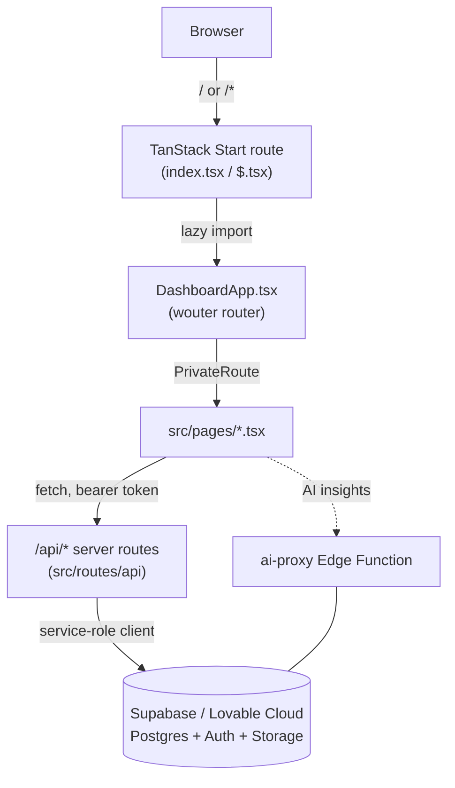

# Infinity Sales Pro

POS, inventory, HR, accounting, and analytics platform built on TanStack Start, React 19, Tailwind v4, and Lovable Cloud (Supabase).

This is a [Lovable](https://lovable.dev)-managed project (`.lovable/`). It can be edited locally with any standard toolchain, or through the Lovable web editor — keep changes compatible with both workflows.

For a full technical deep-dive — application architecture, database schema and relationships, authentication/authorization, every business workflow, and known technical debt — see [`DEVELOPMENT_GUIDE.md`](./DEVELOPMENT_GUIDE.md). This README covers setup, running, building, testing, and deploying.

---

## Table of Contents

- [Overview](#overview)
- [Features](#features)
- [Architecture](#architecture)
- [Requirements](#requirements)
- [Installation](#installation)
- [Environment Variables](#environment-variables)
- [Running Locally](#running-locally)
- [Build Commands](#build-commands)
- [Testing](#testing)
- [Deployment](#deployment)
- [Database](#database)
- [Folder Structure](#folder-structure)
- [Troubleshooting](#troubleshooting)
- [Development Workflow](#development-workflow)
- [License](#license)

---

## Overview

Infinity Sales Pro is a single application covering point-of-sale, inventory/warehouse management, purchasing, HR, accounting, and reporting for retail and wholesale operations. The frontend is a React 19 single-page application; the backend is a set of TanStack Start server routes backed by a Supabase (Lovable Cloud) Postgres database, with one Supabase Edge Function for AI-assisted features.

## Features

Grouped by the modules present in `src/pages/`:

- **Point of Sale** — POS terminal, cash session management (open/close/movements), receipt/label printing, ESL (electronic shelf label) device sync.
- **Sales** — sales recording, sales returns, quotations, price lists, promotions/discount codes, customer loyalty points.
- **Inventory** — product catalog, stock adjustments, stock takes, serial number tracking, reorder rules, product categories.
- **Purchasing** — purchase orders and receiving, purchase returns with settlements, supplier invoices, supplier management.
- **Warehousing** — multi-warehouse and multi-branch stock, inter-warehouse product transfers.
- **Customers** — customer records, customer credit accounts (charges/payments/adjustments), loyalty transactions.
- **HR (HRM)** — employees, departments, attendance, duty rosters, leave requests, payroll runs.
- **Accounting** — expenses, bank accounts and reconciliation, cash management, VAT reporting.
- **Reporting & Analytics** — dashboard reports, analytics, scheduled/on-demand generated reports, AI-assisted insights.
- **Admin & Security** — role-based admin settings, audit logs, security centre (IP blocks, locked accounts, MFA settings), backups, recycle bin.
- **Projects & Tasks** — lightweight project/task tracking.
- **Auth** — email/password login with per-portal (user vs. admin) login pages, registration, password reset, and TOTP-based two-factor authentication setup/verification.

Not every module is enabled by default — several (HR, product transfers) are gated behind admin-configurable permission flags and are hidden until explicitly turned on. See `DEVELOPMENT_GUIDE.md` §6 (Authorization & Permission Model) for the full permission-key reference, and §32 (Known Technical Debt) for gaps in some of the features listed above.

## Architecture

The codebase intentionally runs **two separate routing systems**:

1. **TanStack Start file-based routes** (`src/routes/`) — used for exactly three things: the root HTML shell (`__root.tsx`), the `/api/*` server endpoints, and a single catch-all page route (`src/routes/$.tsx`, plus `src/routes/index.tsx` for `/`) that lazy-loads and mounts `src/DashboardApp.tsx`.
2. **The actual application UI** (dashboard, POS, sales, HRM, etc.) — a client-side SPA living inside `DashboardApp.tsx`, routed with **wouter** (not TanStack Router), rendering lazy-loaded page components from `src/pages/*.tsx` behind a `PrivateRoute` wrapper that enforces authentication, role checks (`adminOnly` / `adminOrManager`), and permission-key checks (`permKey` / `defaultAllow`).



All server routes use the **service-role Supabase client** (`supabaseAdmin`, which bypasses Row Level Security) and enforce access control in application code — ownership filters, role checks, and the `perm_*` permission model — not by the database. Row Level Security policies exist on every table as a second line of defense, not as the primary authorization boundary.

For the full request-handling pattern (generic CRUD factories vs. hand-rolled transactional handlers, which Postgres RPC functions are actually called, and why RLS isn't the primary access-control layer), see `DEVELOPMENT_GUIDE.md` §4, §9, and §10.

## Requirements

From `package.json` / `.nvmrc`-equivalent constraints:

- **Node.js** ≥ 20.10
- **pnpm** ≥ 9 (pinned to `9.15.0` via the `packageManager` field; use Corepack to get the exact version)
- A linked Supabase / Lovable Cloud project (for local development against real data) or your own Supabase project
- Supabase CLI, only if you need to regenerate `src/integrations/supabase/types.ts`

## Installation

```bash
corepack enable
pnpm install --frozen-lockfile
```

This project uses **pnpm only**. Do not use npm, yarn, or bun — mixing package managers produces inconsistent installs and a broken build, even though some older comments in the codebase mention bun.

## Environment Variables

Copy `.env.example` to `.env` and fill in the values for your environment. Known variables used across the codebase:

| Variable | Where it's read | Purpose |
| --- | --- | --- |
| `VITE_SUPABASE_URL` | client (`src/integrations/supabase/client.ts`) | Public Supabase project URL |
| `VITE_SUPABASE_PUBLISHABLE_KEY` | client | Public (anon) Supabase key |
| `VITE_SUPABASE_PROJECT_ID` | client/tooling | Supabase project reference |
| `SUPABASE_URL` | server (`client.server.ts`, auth routes) | Server-side Supabase URL (SSR fallback / service-role client) |
| `SUPABASE_SERVICE_ROLE_KEY` | server only | Service-role key used by `supabaseAdmin` — bypasses RLS, never expose to the client |
| `SUPABASE_PUBLISHABLE_KEY` | server (SSR fallback) | Server-side fallback for the public key |
| `DATABASE_URL` | tooling | Direct Postgres connection string, used by Supabase CLI/migration tooling |
| `VITE_API_BASE_URL` | client (`src/lib/api-bootstrap.ts`) | Base URL for the generated API client; defaults to the page origin if unset |
| `LOVABLE_API_KEY` | server | Lovable AI Gateway key — powers AI Insights, AI product-image generation, and the `ai-proxy` edge function |
| `AI_PROXY_SECRET` | server / `ai-proxy` edge function | Shared secret the `ai-proxy` edge function expects in the `x-proxy-key` header from external callers |
| `OPENAI_API_KEY` | server | Optional — tried first for AI product-image generation before falling back to the Lovable Gateway |
| `NITRO_PRESET` | build only | Set to `node-server` to build for a plain Node host instead of the default Cloudflare Workers target |

**Never commit `.env` or any file containing real secrets, service-role keys, or access tokens.** See `DEVELOPMENT_GUIDE.md` §23 for the exact source locations each variable is read from.

## Running Locally

```bash
pnpm dev            # vite dev server, http://localhost:8080
```

`pnpm dev` starts the SPA against whatever Supabase project your `.env` points to. There is no local Supabase stack checked into this repo — development runs against the linked Lovable Cloud project unless you configure your own.

## Build Commands

```bash
pnpm build                              # production build (Vite + Nitro) -> dist/
pnpm build:dev                          # build in development mode
pnpm preview                            # preview a production build locally
pnpm start                              # run the built server (node dist/server/index.mjs)
NITRO_PRESET=node-server pnpm build     # build for a plain Node host instead of Cloudflare Workers
```

Production output (`dist/`):

- `dist/client/` — static assets (HTML, JS, CSS, images)
- `dist/server/index.mjs` — server entry
- `dist/server/wrangler.json` — Cloudflare Workers config (only when using the default Nitro preset)

## Testing

```bash
pnpm test:unit           # vitest run (jsdom environment)
pnpm test:unit:watch     # vitest watch mode
pnpm test:e2e            # playwright, against a deployed/preview URL — NOT local dev
pnpm test:e2e:ui         # playwright interactive UI
pnpm lint                # eslint . (also enforces Prettier formatting)
pnpm format              # prettier --write .
```

Run a single unit test: `pnpm vitest run src/routes/api/-sales-helpers.test.ts`
Run a single e2e spec: `pnpm playwright test e2e/pos-cash-total.spec.ts`

Playwright specs require `E2E_BASE_URL`, plus `E2E_ADMIN_EMAIL`/`PASSWORD`, `E2E_MANAGER_EMAIL`/`PASSWORD`, and `E2E_USER_EMAIL`/`PASSWORD` (see `e2e/README.md`). They **skip cleanly** if these are unset, and default to `https://infinitysales-pro.lovable.app`. They run with `workers: 1` (sequential) because the suites create and mutate real accounting records and would otherwise race each other across parallel workers. See `DEVELOPMENT_GUIDE.md` §26 for the full list of E2E specs and what each one covers.

## Deployment

The default Nitro preset targets **Cloudflare Workers**. For a plain Node host, build with `NITRO_PRESET=node-server pnpm build` first.

### Hostinger deployment (Cloud / Shared Node hosting, hPanel)

1. In hPanel, create a Node.js application and set **Node 20.x**.
2. Open the SSH terminal for the app and clone or upload the repo.
3. Build with the Node preset:
   ```bash
   corepack enable
   pnpm install --frozen-lockfile
   NITRO_PRESET=node-server pnpm build
   ```
4. Set the **application startup file** to `dist/server/index.mjs`.
5. Configure environment variables (copy from `.env.example`):
   - `VITE_SUPABASE_URL`
   - `VITE_SUPABASE_PUBLISHABLE_KEY`
   - `VITE_SUPABASE_PROJECT_ID`
   - `LOVABLE_API_KEY`
   - `AI_PROXY_SECRET`
   - any additional secrets your deployment requires
6. Restart the Node app from hPanel.

No CI/CD pipeline is checked into this repository — deployments are performed manually following the steps above, or through the Lovable platform's own publish flow.

### Standard deployment framework

For the full, reviewed procedure used to ship a change to the production VPS — GitHub as the source of truth, local validation, review/approval gates, VPS pull, production verification, and rollback — see:

- [`DEPLOYMENT_PLAYBOOK.md`](./DEPLOYMENT_PLAYBOOK.md) — the complete deployment guide, reusable across projects.
- [`DEPLOYMENT_CONFIG.example.md`](./DEPLOYMENT_CONFIG.example.md) — per-project configuration template (server details, commands) — no secrets.
- [`scripts/predeploy-check.ps1`](./scripts/predeploy-check.ps1) — run locally before requesting a deploy review; lints, type-checks, tests, and builds.
- [`scripts/deploy-from-github.sh.example`](./scripts/deploy-from-github.sh.example) — reference template for the VPS-side pull/build/reload sequence (not meant to be run as-is).

## Database

The project database, auth users, and storage are managed through **Lovable Cloud** (Supabase under the hood).

1. Open the project in the Lovable editor.
2. Click **View Backend** (top navigation bar) to open the backend panel.
3. Use the tabs inside the panel to browse:
   - **Database** — view tables, run queries, and manage rows.
   - **Users** — list auth users, edit roles, and configure sign-in methods.
   - **Storage** — upload and manage files in storage buckets.

For normal app administration, no separate Supabase dashboard is required. Developer tasks such as type generation still require Supabase CLI access.

Schema changes are made through SQL migration files in `supabase/migrations/`, applied through Lovable Cloud / Supabase — this repo's scripts do not run migrations automatically. Every table has Row Level Security enabled, though server routes use a service-role client that bypasses it and enforce access control in application code instead (see [Architecture](#architecture)). For the full schema, table relationships, RLS policy inventory, and confirmed drift between the live database and this repo's migrations, see `DEVELOPMENT_GUIDE.md` §7–9 and §28.

### Supabase Type Generation

`src/integrations/supabase/types.ts` is generated from the linked live Supabase project. Do not edit it by hand unless type generation is unavailable and the change has been verified against the live schema.

Requirements:

- Supabase CLI installed and authenticated with `supabase login`, or `SUPABASE_ACCESS_TOKEN` set in the shell/CI environment.
- The project linked via `supabase/config.toml`.
- No service-role keys, database URLs, access tokens, or `.env` files committed to Git.

Commands:

```bash
pnpm supabase:types          # regenerate src/integrations/supabase/types.ts
pnpm supabase:types:check    # CI check: fail if committed types are stale
```

The type-generation command reads schema metadata only. It does not run migrations, reset the database, or change production data.

## Folder Structure

```
.
├── src/
│   ├── DashboardApp.tsx        # wouter SPA shell: providers, lazy page imports, PrivateRoute, route table
│   ├── routes/                 # TanStack Start file-based routes
│   │   ├── __root.tsx          # HTML shell / root layout
│   │   ├── index.tsx, $.tsx    # mount DashboardApp
│   │   └── api/                # server routes (REST API) + shared server-only helpers
│   ├── pages/                  # one component per application route, lazy-loaded by DashboardApp
│   ├── components/             # shared UI components (shadcn-based), components/ui = primitives
│   ├── lib/                    # auth context, permissions context, API bootstrap, error handling, utils
│   ├── hooks/                  # shared React hooks (online users, realtime sync, session heartbeat, etc.)
│   ├── integrations/supabase/  # auto-generated Supabase client/types — do not hand-edit
│   ├── workspace/api-client-react/ # generated typed API client (Orval) consumed by pages/lib
│   └── test/                   # Vitest setup
├── supabase/
│   ├── migrations/             # SQL migration history
│   └── functions/ai-proxy/     # the one Supabase Edge Function in this repo
├── e2e/                        # Playwright end-to-end tests
├── public/                     # static public assets
├── scripts/                    # tooling scripts (e.g. Supabase type generation)
└── dist/                       # build output (generated, not committed)
```

`src/routes/README.md` documents the TanStack Start file-routing conventions in more detail — never create `src/pages/`-style files or Next.js/Remix-style `app/` directories under `src/routes/`; that directory is exclusively the TanStack file router.

## Troubleshooting

- **"Duplicate plugin" or unexpected Vite build errors** — `vite.config.ts` already wires up `tanstackStart`, `viteReact`, `tailwindcss`, `tsConfigPaths`, Nitro, and other plugins via `@lovable.dev/vite-tanstack-config`. Don't add these manually.
- **`SUPABASE_URL is undefined` in a deployed (Cloudflare Workers) environment despite being set** — on Cloudflare Workers, `process.env` binds **per request**, not at module load. Never read `process.env.X` at module scope in server code; read it inside the handler/function body.
- **A 500 response with body `{"unhandled":true,"message":"HTTPError"}`** — this is h3 swallowing an in-handler throw. `src/server.ts` detects and replaces this with a friendly error page; if you still see the raw JSON, check that your entry point is going through `src/server.ts` and not the bundled TanStack Start server entry directly.
- **Stale or missing Supabase types** — run `pnpm supabase:types` (requires `supabase login` or `SUPABASE_ACCESS_TOKEN`). `pnpm supabase:types:check` will fail CI if the committed types drift from the live schema.
- **Playwright tests skip with no output** — this is expected if `E2E_BASE_URL`/`E2E_ADMIN_EMAIL`/etc. are unset; see [Testing](#testing) and `e2e/README.md`.
- **Build works with `pnpm build` but the server doesn't start on your host** — you're likely on the default Cloudflare Workers preset. Rebuild with `NITRO_PRESET=node-server pnpm build` for a plain Node host.
- **Inconsistent installs / broken build after a fresh clone** — check that you used `pnpm`, not `npm`/`yarn`/`bun`. Delete `node_modules` and reinstall with `pnpm install --frozen-lockfile` if in doubt.

## Development Workflow

This repository is developed with specific process guardrails and reference material documented in three files at the project root:

- **`DEVELOPMENT_GUIDE.md`** — the authoritative system reference: architecture, database schema/relationships, RLS, every business workflow, and known technical debt. Read this before making non-trivial changes.
- **`CLAUDE.md`** — repository- and tool-specific instructions for AI-assisted development in Claude Code (workflow, database, testing, and communication rules).
- **`AI_RULES.md`** — universal engineering rules that apply to any AI coding assistant used on this project (understand-before-building, planning before major changes, database and migration discipline, testing before calling work done, git/deployment approval gates, and security requirements).

In short: inspect existing implementation before changing it, use migrations for schema changes, run lint/type-check/tests/build after any change, and never commit, push, deploy, or apply production migrations without explicit approval. Whenever a change affects architecture or workflows, update `DEVELOPMENT_GUIDE.md` (and this README, if setup/usage is affected) to match.

## License

Private / proprietary.
